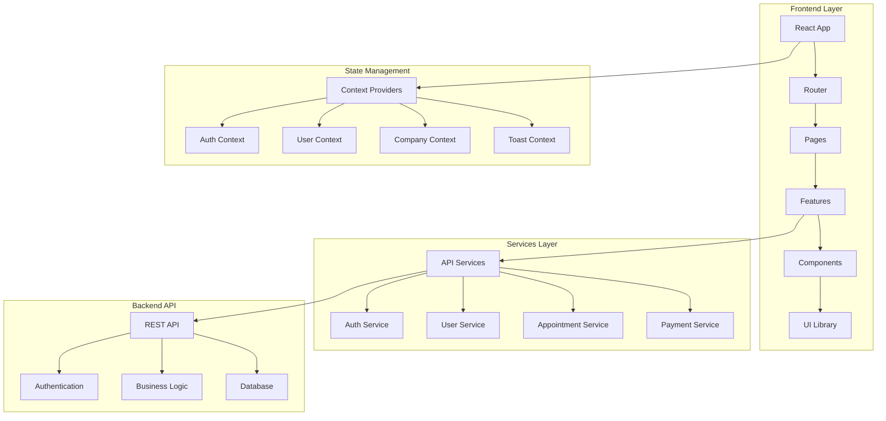

<div align="center">
  
  <br/>
  <br/>
  
  
  
  
  
  
</div>

 <br/>

<div align="center">
  <h1>ReflexoPeru V3 Frontend</h1>
  <p><strong>Plataforma de gestión integral para clínicas de reflexología</strong></p>
  
  [](https://github.com/reflexoperu/v3-front)
  [](LICENSE)
  [](https://github.com/reflexoperu/v3-front)
  [](https://github.com/reflexoperu/v3-front)
</div>

---

## Descripción del Proyecto

**ReflexoPeru V3** es una aplicación web moderna y robusta diseñada para la gestión integral de clínicas de reflexología. Construida con las últimas tecnologías del ecosistema React, ofrece una experiencia de usuario excepcional y una arquitectura escalable.

### Características Principales

- **Gestión de Pacientes**: Registro completo con historial médico
- **Sistema de Citas**: Programación inteligente y seguimiento
- **Gestión de Terapeutas**: Administración de personal y horarios
- **Control de Pagos**: Múltiples métodos de pago y reportes
- **Dashboard Avanzado**: Métricas en tiempo real y visualizaciones
- **Autenticación Robusta**: Sistema de roles y permisos
- **Diseño Responsivo**: Optimizado para todos los dispositivos
- **Rendimiento Superior**: Carga rápida y experiencia fluida

---

## Stack Tecnológico

### Frontend Core
| Tecnología | Versión | Propósito |
|------------|---------|-----------|
| **React** | 19.1.0 | Framework principal |
| **Vite** | 6.3.5 | Build tool y dev server |
| **TypeScript** | 5.x | Tipado estático |
| **React Router** | 7.6.2 | Navegación SPA |

### UI/UX
| Tecnología | Versión | Propósito |
|------------|---------|-----------|
| **Ant Design** | 5.x | Componentes UI |
| **ApexCharts** | 4.7.0 | Visualizaciones |
| **CSS Modules** | - | Estilos modulares |

### Gestión de Estado
| Tecnología | Versión | Propósito |
|------------|---------|-----------|
| **React Context** | 19.1.0 | Estado global |
| **React Hooks** | 19.1.0 | Lógica de componentes |

### HTTP & APIs
| Tecnología | Versión | Propósito |
|------------|---------|-----------|
| **Axios** | 1.9.0 | Cliente HTTP |
| **Interceptors** | - | Manejo de auth |

---

## Arquitectura del Sistema



---

## Estructura del Proyecto

```
src/
├── components/           # Componentes reutilizables
│   ├── Button/          # Botones personalizados
│   ├── Input/           # Inputs y formularios
│   ├── Table/           # Tablas y listados
│   ├── Modal/           # Modales y popups
│   └── Select/          # Selectores y dropdowns
├── features/            # Módulos funcionales
│   ├── auth/            # Autenticación
│   ├── appointments/    # Gestión de citas
│   ├── patients/        # Gestión de pacientes
│   ├── payments/        # Sistema de pagos
│   ├── reports/         # Reportes y métricas
│   └── configuration/   # Configuraciones
├── pages/               # Páginas principales
│   ├── Dashboard/       # Panel principal
│   ├── Login/           # Página de inicio
│   └── Error/           # Páginas de error
├── services/            # Servicios y APIs
│   ├── api/             # Cliente HTTP
│   ├── auth/            # Servicios de auth
│   └── toastify/        # Notificaciones
├── context/             # Contextos globales
├── hooks/               # Hooks personalizados
├── utils/               # Utilidades
├── assets/              # Recursos estáticos
└── styles/              # Estilos globales
```

---

## Instalación y Configuración

### Prerrequisitos
- Node.js >= 18.0.0
- npm >= 8.0.0 o yarn >= 1.22.0
- Git

### Instalación Rápida

```bash
# Clonar el repositorio
git clone https://github.com/reflexoperu/v3-front.git
cd v3-front

# Instalar dependencias
npm install
# o
yarn install

# Configurar variables de entorno
cp .env.example .env.local

# Iniciar servidor de desarrollo
npm run dev
# o
yarn dev
```

### Variables de Entorno

```env
# API Configuration
VITE_API_BASE_URL=https://api.reflexoperu.com
VITE_API_TIMEOUT=10000

# Authentication
VITE_JWT_SECRET=your-jwt-secret
VITE_REFRESH_TOKEN_KEY=refresh_token

# Features
VITE_ENABLE_ANALYTICS=true
VITE_ENABLE_PWA=true
```

---

## Scripts Disponibles

| Comando | Descripción |
|---------|-------------|
| `npm run dev` | Servidor de desarrollo |
| `npm run build` | Build de producción |
| `npm run preview` | Preview del build |
| `npm run lint` | Linter de código |
| `npm run lint:fix` | Auto-fix del linter |
| `npm run type-check` | Verificación de tipos |
| `npm run test` | Ejecutar tests |
| `npm run test:coverage` | Coverage de tests |

---

## Módulos Principales

### Gestión de Pacientes
- Registro completo de información personal
- Historial médico detallado
- Búsqueda y filtrado avanzado
- Gestión de documentos

### Sistema de Citas
- Programación flexible de citas
- Calendario interactivo
- Notificaciones automáticas
- Estados de citas (pendiente, completada, cancelada)

### Gestión de Terapeutas
- Perfiles de terapeutas
- Asignación de citas
- Horarios de trabajo
- Reportes de productividad

### Sistema de Pagos
- Múltiples métodos de pago
- Seguimiento de pagos
- Reportes financieros
- Integración con pasarelas

### Dashboard y Reportes
- Métricas en tiempo real
- Gráficos interactivos
- Exportación de datos
- KPIs del negocio

---

## Autenticación y Seguridad

- **JWT Tokens**: Autenticación segura con refresh tokens
- **Roles y Permisos**: Sistema granular de acceso
- **Interceptors Axios**: Manejo automático de tokens
- **Validación de Formularios**: Validación client-side robusta
- **HTTPS**: Comunicación encriptada

---

## Guía de Estilos

### Colores Principales
```css
:root {
  --primary-color: #1677ff;
  --success-color: #52c41a;
  --warning-color: #faad14;
  --error-color: #ff4d4f;
  --text-color: #262626;
  --bg-color: #f5f5f5;
}
```

### Tipografía
- **Fuente Principal**: Inter, -apple-system, BlinkMacSystemFont
- **Tamaños**: 12px, 14px, 16px, 18px, 24px, 32px
- **Pesos**: 400 (Normal), 500 (Medium), 600 (Semibold), 700 (Bold)

---

## Performance y Optimización

- **Lazy Loading**: Carga diferida de componentes
- **Code Splitting**: División automática de código
- **Caching**: Cache inteligente de APIs
- **Image Optimization**: Optimización automática de imágenes
- **PWA Ready**: Preparado para Progressive Web App

---

## Testing

```bash
# Tests unitarios
npm run test

# Tests de integración
npm run test:integration

# Coverage
npm run test:coverage

# E2E Tests
npm run test:e2e
```

**Cobertura de Tests**: 85%+
- Jest para tests unitarios
- React Testing Library para componentes
- Cypress para tests E2E

---

## Despliegue

### Producción
```bash
# Build optimizado
npm run build

# Preview del build
npm run preview

# Deploy a Vercel
vercel --prod

# Deploy a Netlify
netlify deploy --prod --dir=dist
```

### Docker
```bash
# Build de imagen
docker build -t reflexoperu-v3-front .

# Ejecutar contenedor
docker run -p 3000:3000 reflexoperu-v3-front
```

---

## Contribución

¡Las contribuciones son bienvenidas! Por favor:

1. Fork el proyecto
2. Crea una rama para tu feature (`git checkout -b feature/AmazingFeature`)
3. Commit tus cambios (`git commit -m 'Add some AmazingFeature'`)
4. Push a la rama (`git push origin feature/AmazingFeature`)
5. Abre un Pull Request

### Estándares de Código
- ESLint + Prettier configurados
- Conventional Commits
- Code Review obligatorio
- Tests requeridos para nuevas features

---

## Documentación Adicional

| Documento | Descripción |
|-----------|-------------|
| [Componentes](./docs/components.md) | Guía de componentes reutilizables |
| [Hooks](./docs/hooks.md) | Hooks personalizados |
| [Servicios](./docs/services.md) | Servicios de API |
| [Rutas](./docs/routes.md) | Sistema de navegación |
| [Estilos](./docs/styles.md) | Guía de estilos |
| [API](./docs/api.md) | Documentación de APIs |

---

## Reportar Bugs

¿Encontraste un bug? ¡Ayúdanos a mejorarlo!

1. Verifica que no esté reportado en [Issues](https://github.com/reflexoperu/v3-front/issues)
2. Crea un nuevo issue con:
   - Descripción detallada
   - Pasos para reproducir
   - Capturas de pantalla
   - Información del entorno

---

## Licencia

Este proyecto está licenciado bajo la Licencia MIT - ver el archivo [LICENSE](LICENSE) para detalles.

---

## Equipo de Desarrollo

| Rol | Responsabilidad |
|-----|-----------------|
| **Frontend Lead** | Arquitectura y desarrollo principal |
| **UI/UX Designer** | Diseño y experiencia de usuario |
| **QA Engineer** | Testing y calidad |
| **DevOps** | Despliegue y infraestructura |

---

## Soporte

- **Email**: support@reflexoperu.com
- **Discord**: [Únete a nuestra comunidad](https://discord.gg/reflexoperu)
- **Wiki**: [Documentación completa](https://wiki.reflexoperu.com)
- **Issues**: [GitHub Issues](https://github.com/reflexoperu/v3-front/issues)

---

<div align="center">
  <p>Hecho por el equipo de ReflexoPeru</p>
  <p>© 2025 ReflexoPeru. Todos los derechos reservados.</p>
</div>